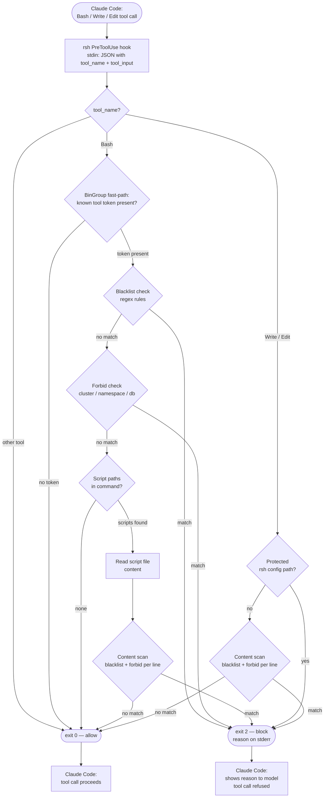

# rsh Documentation

`rsh` (Rust Security Hook) is a Claude Code PreToolUse hook that blocks dangerous shell commands, file writes, and script executions before Claude Code can carry them out.

## How it works

`rsh` registers itself in `~/.claude/settings.json` (global) or `.claude/settings.json` (project-local). Claude Code invokes it before every `Bash`, `Write`, and `Edit` tool call. If `rsh` exits with code 2 the tool call is refused and the reason is shown to the model.

Two independent pipelines decide whether to block:

1. **Blacklist** — regex rules matched against the command string or file content.
2. **Forbid** — target-based rules that check which Kubernetes cluster/namespace or database host a command would reach.



## Behavior documentation

Detailed descriptions of what is blocked and why:

| File | Topic |
|---|---|
| [kubernetes-rules.md](behavior/kubernetes-rules.md) | All `kubectl` and `helm` rules (destructive, pod access, privilege escalation, service disruption, subprocess-list bypass) |
| [docker-rules.md](behavior/docker-rules.md) | Docker and Docker Compose rules (volume destruction, container/image cleanup) |
| [sql-rules.md](behavior/sql-rules.md) | SQL keyword rules (DELETE, TRUNCATE, DROP, ALTER TABLE, CREATE) and forbidden database hosts |
| [forbid-system.md](behavior/forbid-system.md) | How the forbid check works for clusters, namespaces, and databases — storage, CLI, flag extraction, kubeconfig fallback |
| [alias-system.md](behavior/alias-system.md) | How aliases are registered and detected, and how they expand into rule regexes |
| [content-scanning.md](behavior/content-scanning.md) | Write/Edit tool interception, and script file scanning when a Bash command invokes a script |

## Architecture decision records

Rationale for key design choices:

| File | Decision |
|---|---|
| [adr/001-sql-blocking.md](adr/001-sql-blocking.md) | SQL keyword rules and forbidden database hosts |
| [adr/002-docker-blacklist-rules.md](adr/002-docker-blacklist-rules.md) | Docker and Docker Compose blacklist rules |
| [adr/003-write-edit-and-script-scanning.md](adr/003-write-edit-and-script-scanning.md) | Write/Edit tool interception and script file content scanning |
| [adr/004-fail-open-exit-code-contract.md](adr/004-fail-open-exit-code-contract.md) | Fail-open design and exit code semantics (exit 2 vs exit 1) |
| [adr/005-subprocess-list-bypass.md](adr/005-subprocess-list-bypass.md) | Blocking kubectl/helm in Python/Ruby/Node subprocess argument lists |
| [adr/006-kubernetes-helm-initial-blacklist.md](adr/006-kubernetes-helm-initial-blacklist.md) | Initial Kubernetes and Helm blacklist rules — rationale and scope |
| [adr/007-alias-system-design.md](adr/007-alias-system-design.md) | Alias system: storage format, auto-detection, and runtime caching |
| [adr/008-rule-disable-enable.md](adr/008-rule-disable-enable.md) | Per-rule disable/enable toggle — storage, CLI, and testability design |

## Quick reference

```sh
rsh init -g                        # register hook globally
rsh init                           # register hook in current project
rsh check "kubectl delete ns prod" # test a command manually
rsh list                           # show all rules, forbid entries, and aliases
rsh alias kubectl k                # register an alias
rsh detect-aliases                 # auto-detect aliases from $PATH
rsh forbid cluster prod-eu         # forbid a cluster
rsh forbid namespace kube-system   # forbid a namespace
rsh forbid database prod-db.host   # forbid a database host
rsh forbid list                    # show all forbid entries
rsh forbid remove cluster prod-eu  # remove an entry
```
