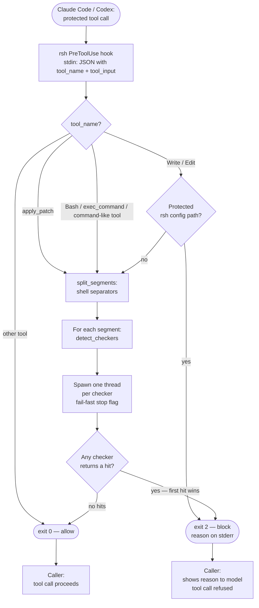

# rsh Documentation

`rsh` (Rust Security Hook) is a Claude Code and Codex PreToolUse hook that blocks dangerous
shell commands, file writes, and script executions before those tools can carry them out.

## How it works

`rsh` registers itself in Claude `settings.json` or Codex `hooks.json`, either globally or
project-locally depending on `rsh init`. Claude invokes it before `Bash`, `Write`, and `Edit`
tool calls. Codex invokes it before `apply_patch` and any command-carrying tool call (for
example `Bash`, `exec_command`, or namespaced variants such as `functions.exec_command`). If
`rsh` exits with code 2 the tool call is refused and the reason is shown to the model.

The core idea: **each tool family is one category, and that category owns all checks for
that tool** — regex rules, forbid checks, and alias expansion.



## Tool handling

How each intercepted tool call is processed end-to-end:

| Page | What it explains |
|---|---|
| [[bash-tool\|bash-tool.md]] | Segment splitting, script detection, chained commands, parallel checker pipeline |
| [[write-edit-tool\|write-edit-tool.md]] | Protected path check, content scan for Claude `Write`/`Edit` and Codex `apply_patch` |

## Tool categories (checkers)

Each tool family has its own checker with its own set of measures:

| Page | Checker | Measures applied |
|---|---|---|
| [[checker-kubectl\|checker-kubectl.md]] | `KubectlChecker` | Blacklist rules (destructive, pod access, privilege escalation, disruption) + forbid cluster/namespace |
| [[checker-helm\|checker-helm.md]] | `HelmChecker` | Blacklist rules (helm uninstall) + forbid cluster/namespace |
| [[checker-docker\|checker-docker.md]] | `DockerChecker` | Blacklist rules (volume destruction, container/image cleanup) |
| [[checker-fallback\|checker-fallback.md]] | `FallbackChecker` | SQL keyword rules + subprocess list bypass + database forbid |
| [[checker-rsh\|checker-rsh.md]] | `RshChecker` | Self-protection rules |

## Supporting systems

| Page | Topic |
|---|---|
| [[forbid-system\|forbid-system.md]] | Forbid lists — storage, CLI, cluster/namespace/database target extraction |
| [[alias-system\|alias-system.md]] | Alias registration, auto-detection, and runtime expansion |
| [[fast-path-optimization\|fast-path-optimization.md]] | BinGroup fast-path — skipping all checks when no known tool is present |

## Architecture decision records

| File | Decision |
|---|---|
| [[001-sql-blocking\|adr/001-sql-blocking.md]] | SQL keyword rules and forbidden database hosts |
| [[002-docker-blacklist-rules\|adr/002-docker-blacklist-rules.md]] | Docker and Docker Compose blacklist rules |
| [[003-write-edit-and-script-scanning\|adr/003-write-edit-and-script-scanning.md]] | Write/Edit tool interception and script file content scanning |
| [[004-fail-open-exit-code-contract\|adr/004-fail-open-exit-code-contract.md]] | Fail-open design and exit code semantics |
| [[005-subprocess-list-bypass\|adr/005-subprocess-list-bypass.md]] | Blocking kubectl/helm in subprocess argument lists |
| [[006-kubernetes-helm-initial-blacklist\|adr/006-kubernetes-helm-initial-blacklist.md]] | Initial Kubernetes and Helm blacklist rules |
| [[007-alias-system-design\|adr/007-alias-system-design.md]] | Alias system: storage format, auto-detection, runtime caching |
| [[008-rule-disable-enable\|adr/008-rule-disable-enable.md]] | Per-rule disable/enable toggle |
| [[009-bingroup-fast-path\|adr/009-bingroup-fast-path.md]] | BinGroup fast-path |
| [[010-criterion-benchmarks\|adr/010-criterion-benchmarks.md]] | Criterion benchmark suite |
| [[011-tool-checker-parallel-pipeline\|adr/011-tool-checker-parallel-pipeline.md]] | ToolChecker trait and parallel check pipeline |
| [[012-per-checker-documentation-structure\|adr/012-per-checker-documentation-structure.md]] | Per-checker documentation structure — replacing thematic docs |

## Quick reference

```sh
rsh init -g                        # auto-detect and register hooks globally
rsh init                           # auto-detect and register hooks in current project
rsh init --tool codex              # force Codex-only installation
rsh check "kubectl delete ns prod" # test a command manually
rsh list                           # show all rules, forbid entries, and aliases
rsh alias kubectl k                # register an alias
rsh detect-aliases                 # auto-detect aliases from $PATH
rsh forbid cluster prod-eu         # forbid a cluster
rsh forbid namespace kube-system   # forbid a namespace
rsh forbid database prod-db.host   # forbid a database host
rsh forbid list                    # show all forbid entries
rsh forbid remove cluster prod-eu  # remove an entry
```
